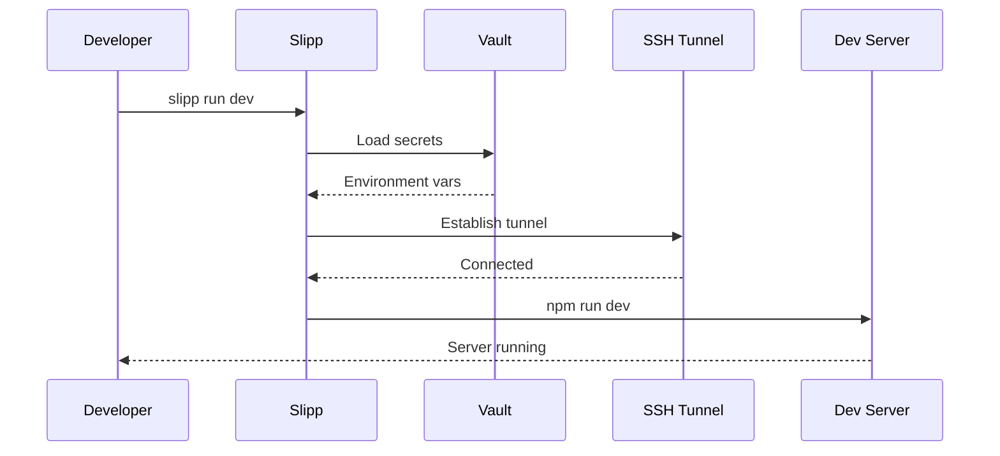
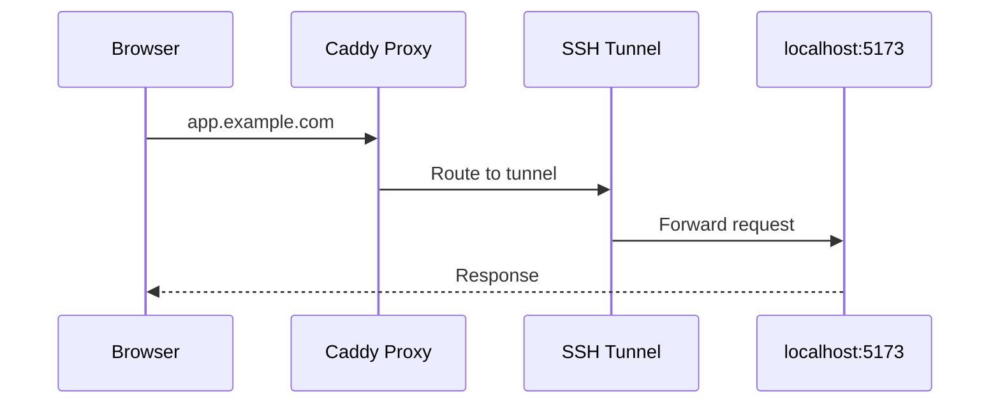
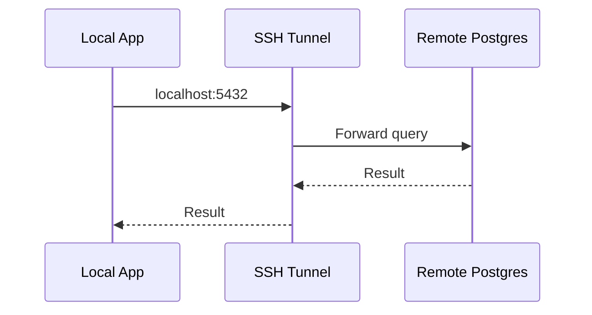

import { Steps, Tabs, TabItem } from "@astrojs/starlight/components";

Develop locally while connected to remote infrastructure. Run profiles combine:
- **Commands** - Your local dev server
- **Tunnels** - SSH connections to remote services
- **Secrets** - Environment variables from vault

## How It Works



## Quick Start

<Steps>

1. **Create a run profile**

   ```bash
   slipp run dev \
     --cmd "npm run dev" \
     --tunnel-out 5173:app.example.com@myserver \
     --vault myproject
   ```

2. **Run it anytime**

   ```bash
   slipp run dev
   ```

</Steps>

This profile:
1. Loads secrets from `myproject` vault into environment
2. Opens reverse tunnel (local port accessible via domain)
3. Runs your dev command

## Tunnels

Tunnels bridge your local machine and remote servers via SSH.

### tunnel-out (Reverse Tunnel)

Expose your local dev server to the internet through the remote server.

```bash
--tunnel-out 5173:app.example.com@myserver
```

| Part | Description |
|------|-------------|
| `5173` | Local port to expose |
| `app.example.com` | Domain that routes to tunnel |
| `myserver` | SSH host from inventory |



**Use case:** Test OAuth callbacks, webhooks, or production integrations locally.

:::note
Requires dev proxy setup on VPS. See [bootstrap proxy](/reference/cli#bootstrap-proxy).
:::

### tunnel-in (Forward Tunnel)

Pull a remote service to your local machine.

```bash
--tunnel-in postgres:5432@myserver
```

| Part | Description |
|------|-------------|
| `postgres` | Service name (resolved via inventory) |
| `5432` | Port to forward |
| `myserver` | SSH host |



**Use case:** Connect local code to remote database without exposing it publicly.

### Combining Tunnels

Use both tunnel types together:

```bash
slipp run dev \
  --tunnel-out 5173:app.example.com@myserver \
  --tunnel-in postgres:5432@myserver \
  --vault myproject \
  --cmd "npm run dev"
```

Now your local app:
- Is accessible at `https://app.example.com`
- Connects to remote Postgres at `localhost:5432`

## Managing Profiles

### List saved profiles

```bash
slipp runs list
```

Output shows commands, vaults, and tunnel configuration:

```
Saved profiles:

  dev:
    cmd: npm run dev
    vaults: myproject
    tunnel-out: 5173:app.example.com@myserver
```

### Remove a profile

```bash
slipp runs remove dev
```

### Runtime overrides

Add options at runtime without modifying the saved profile:

```bash
# Add extra environment variable
slipp run dev --env DEBUG=true

# Add another vault
slipp run dev --vault shared-secrets

# Pass args to command
slipp run dev -- --port 3000
```

## Environment Variables

### From vault secrets

Vault secrets are loaded as environment variables:

```bash
slipp run dev --vault myproject
```

If `myproject` vault contains:
```yaml
vault_db_password: "secret123"
vault_api_key: "abc..."
```

Your command runs with:
```bash
DB_PASSWORD=secret123 API_KEY=abc... npm run dev
```

:::tip
Secret names are transformed: `vault_db_password` becomes `DB_PASSWORD`.
:::

### Custom variables

Add custom environment variables:

```bash
slipp run dev --env NODE_ENV=development --env DEBUG=true
```

## Examples

### SvelteKit with remote auth

```bash
slipp run dev \
  --cmd "npm run dev" \
  --tunnel-out 5173:app.example.com@myserver \
  --vault auth-service
```

### Flask with remote PostgreSQL

```bash
slipp run dev \
  --cmd "flask run" \
  --tunnel-in postgres:5432@myserver \
  --vault myproject \
  --env FLASK_DEBUG=1
```

### Multiple services

```bash
# Frontend
slipp run frontend \
  --cmd "npm run dev" \
  --tunnel-out 3000:app.example.com@myserver

# Backend (different profile)
slipp run backend \
  --cmd "uvicorn main:app --reload" \
  --tunnel-in postgres:5432@myserver \
  --tunnel-out 8000:api.example.com@myserver
```

## Prerequisites

### Dev proxy (for tunnel-out)

Before using `--tunnel-out`, set up the dev proxy:

```bash
slipp bootstrap proxy myserver --email admin@example.com
```

This installs Caddy on your VPS to route domains to tunnels.

### Vault (for secrets)

Create vault secrets for your project:

```bash
slipp secrets add vault_db_password myproject
slipp secrets add vault_api_key myproject
```

See [Secrets Management](/guides/secrets) for details.

## Troubleshooting

:::caution[Tunnel not connecting?]
- Check SSH connectivity: `ssh slipp@yourserver`
- Verify service exists: `slipp ps`
- Check VPS firewall allows the port
:::

:::caution[Secrets not loading?]
- Verify vault exists: `slipp secrets list`
- Check vault password is correct
- Ensure vault is encrypted: `ansible-vault view vault.yml`
:::
