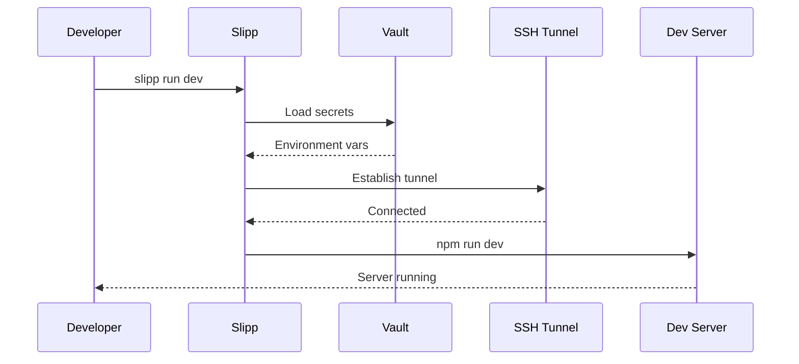
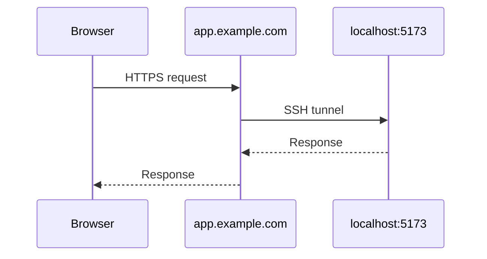
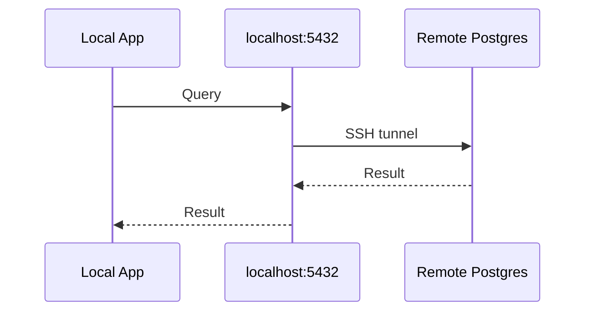

## Overview

Run profiles let you develop locally while connected to remote infrastructure via tunnels and vault secrets.



## Create a Profile

```bash
slipp run dev \
  --cmd "npm run dev" \
  --tunnel-out 5173:app.example.com@myserver \
  --vault myproject
```

This creates a profile named `dev` that:

1. Loads secrets from the `myproject` vault
2. Sets up a reverse tunnel (local to remote)
3. Runs `npm run dev`

## Execute a Profile

```bash
slipp run dev
```

## List Profiles

```bash
slipp runs list
```

## Remove a Profile

```bash
slipp runs remove dev
```

## Tunnel Types

### tunnel-out (Reverse Tunnel)

Expose your local dev server to the remote infrastructure:

```bash title="Format"
--tunnel-out 5173:app.example.com@myserver
```



### tunnel-in (Forward Tunnel)

Pull a remote service to your local machine:

```bash title="Format"
--tunnel-in postgres:5432@myserver
```


