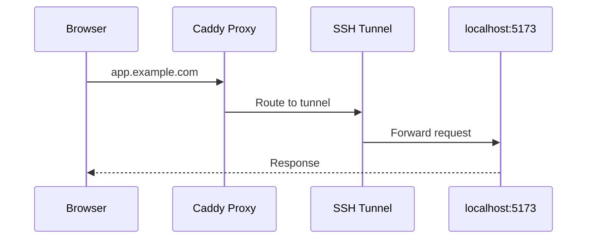
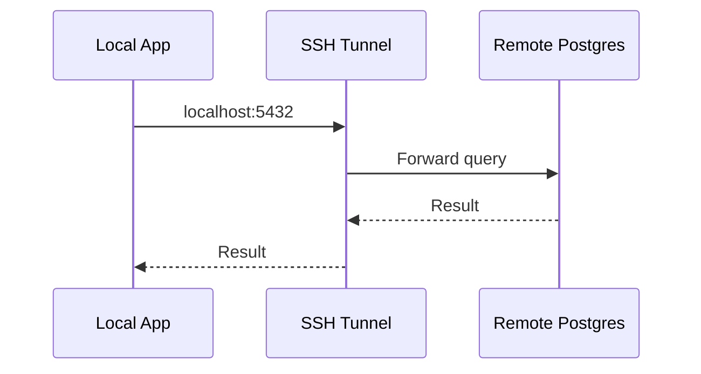

## Overview

Tunnels bridge your local machine and remote servers via SSH.

## tunnel-out (Reverse Tunnel)

Expose a local port to remote infrastructure:

```bash
slipp run dev --tunnel-out 5173:app.example.com@myserver
```

| Component         | Description             |
| ----------------- | ----------------------- |
| `5173`            | Local port to expose    |
| `app.example.com` | Domain routed to tunnel |
| `myserver`        | SSH host from inventory |



### Use Case

Develop locally while integrated with remote services (auth, database, APIs).

## tunnel-in (Forward Tunnel)

Pull a remote service to localhost:

```bash
slipp run dev --tunnel-in postgres:5432@myserver
```

| Component  | Description                           |
| ---------- | ------------------------------------- |
| `postgres` | Service name (resolved via inventory) |
| `5432`     | Port to forward                       |
| `myserver` | SSH host                              |



### Use Case

Connect local code to remote database without exposing it publicly.

## Multiple Tunnels

Combine tunnels in a single profile:

```bash
slipp run dev \
  --tunnel-out 5173:app.example.com@myserver \
  --tunnel-in postgres:5432@myserver \
  --cmd "npm run dev"
```
